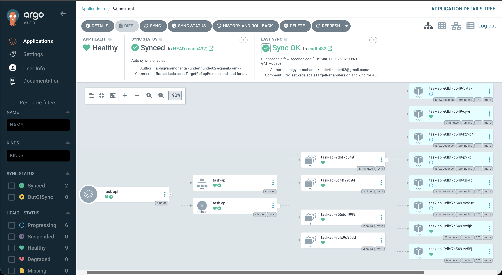
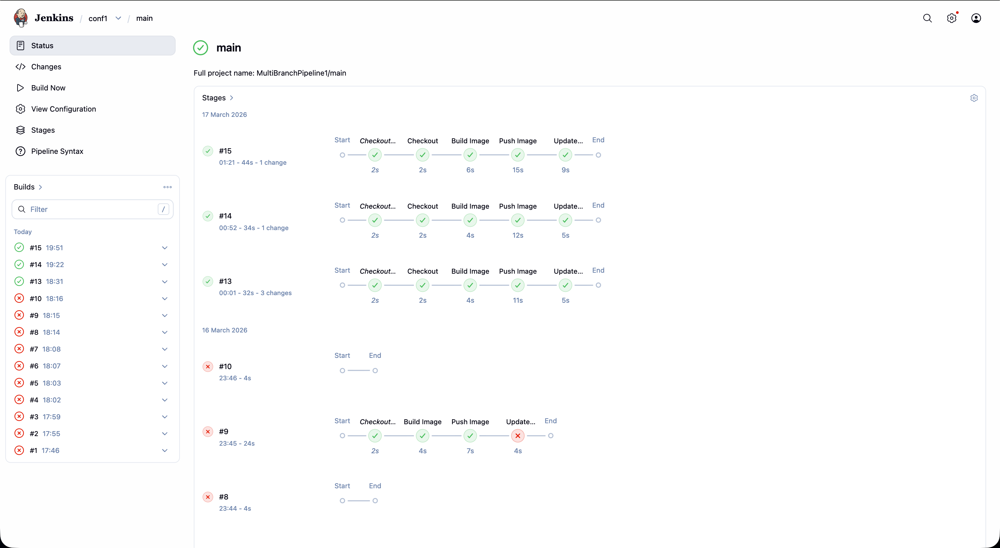
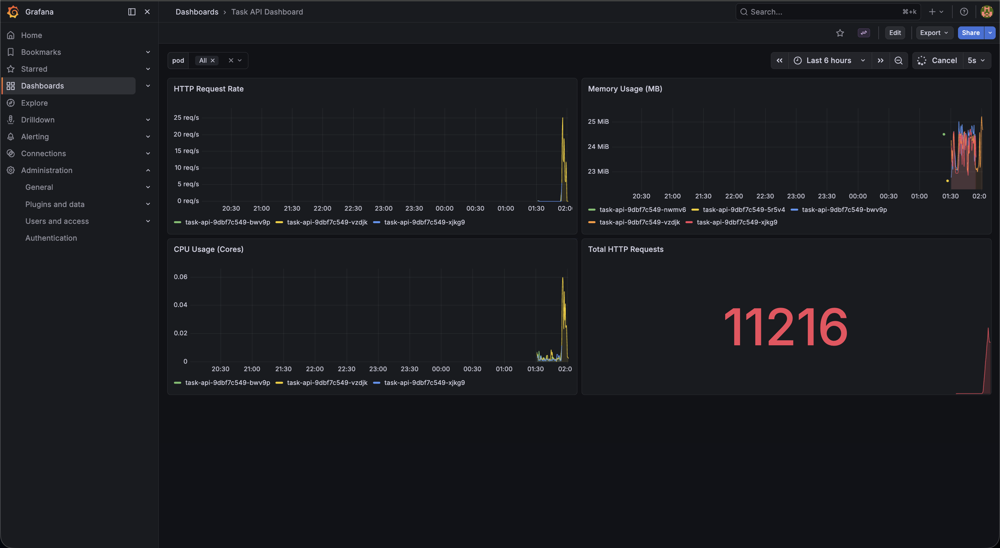

# Kubernetes GitOps Delivery Platform

This repository serves as the central configuration source for the GitOps delivery platform, managing the deployment of an application and its supporting infrastructure.

## Architecture & Tooling

The platform is designed around cloud-native principles and utilizes the following stack:

*   **Continuous Delivery (GitOps):** [ArgoCD](https://argoproj.github.io/cd/) synchronizes the cluster state with this Git repository, providing a declarative approach to infrastructure and application deployment.
*   **Progressive Delivery:** [Argo Rollouts](https://argoproj.github.io/rollouts/) handles deployments, utilizing a Canary strategy.
*   **Continuous Integration:** [Jenkins](https://www.jenkins.io/) builds the application images, pushes them to the container registry, and automatically updates the image tags in this repository.
*   **Autoscaling:** [KEDA](https://keda.sh/) (Kubernetes Event-driven Autoscaling) scales the application based on custom Prometheus metrics (e.g., HTTP request rate).
*   **Monitoring & Observability:** [Prometheus](https://prometheus.io/) and [Grafana](https://grafana.com/) provide deep visibility into application performance, enabling data-driven automated canary analysis and autoscaling.

## Features

### Automated Canary Rollouts
Deployments use Argo Rollouts to perform canary releases. An `AnalysisTemplate` queries Prometheus to verify the success rate and metric stability of the new version before fully promoting it to production.

### Event-Driven Autoscaling (KEDA)
The platform uses KEDA to autoscale the `task-api` pods dynamically based on the current load. The `ScaledObject` uses a Prometheus trigger, allowing the system to scale out proactively when the HTTP request rate spikes.

## Visual Overview

### 1. Continuous Delivery with ArgoCD
ArgoCD manages the health and sync status of the applications deployed in the cluster.

### 2. Continuous Integration with Jenkins
Jenkins handles the building and pushing of artifacts, triggering the GitOps workflow.

### 3. Monitoring & Autoscaling Insights with Grafana
Custom Grafana dashboards visualize the metrics scraped by Prometheus, which power both our autoscaler and canary analysis.

